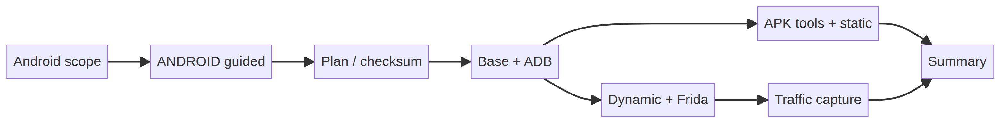

# ANDROID ANALYSIS — Reversing & Instrumentation Toolchain



## Higiene del repo

Instalador Bash de toolchain Android para reversing, análisis estático, instrumentación dinámica y captura de tráfico en dispositivos/emuladores de laboratorio autorizados. Conserva seis fases: base, ADB, APK tools, análisis estático, instrumentación dinámica y tráfico. No conecta automáticamente dispositivos ni ejecuta una app objetivo. El repositorio público no contiene credenciales, tokens, configuraciones de engagement, capturas reales, logs ni artefactos generados. Las carpetas `evidence/`, `screenshots/` y `pruebas/` se mantienen fuera del árbol publicado; `tests/` se conserva exclusivamente como control de regresión técnica. Las plantillas y fixtures, cuando existen, usan valores de laboratorio y no conceden autorización.

## Licencia

El código se distribuye bajo **MIT License**. Consulta el archivo `LICENSE` para el texto legal completo. El uso de funciones que envían tráfico, transmiten RF, interactúan con dispositivos, ejecutan módulos o procesan material de autenticación requiere autorización escrita independiente.

## Estructura

`src/android_toolchain/core.sh` conserva las seis fases y plan JSON; `src/no4nn.sh` resuelve el entrypoint; `archive/original/` mantiene el fuente heredado; `tests/` verifica shell y dry-run. La imagen `assets/operation-flow.png` resume la transición operacional; el banner interno se mantiene en el entrypoint o núcleo de la herramienta.

## Flujo recomendado

El flujo recomendado es ejecutar `--guided` o `--interactive`, elegir `--static-only`, `--dynamic-only` o `all`, generar plan con `--plan-json`, revisar `JADX_SHA256` y solo después instalar. Para estático usa `sudo -E ./src/no4nn.sh --static-only`; para una previsión dinámica usa `./src/no4nn.sh --dry-run --dynamic-only`. ADB no se conecta automáticamente a dispositivos. El operador debe registrar target, ventana, privilegios, dependencias, resultado y procedimiento de cleanup. Un plan, dry-run o diagnóstico no equivale a una ejecución real ni a una vulnerabilidad confirmada.

## Pasos de instalación

Requisitos: Ubuntu, Bash, `sudo` para APT, Python/venv, Java y conectividad HTTPS. Las fases dinámicas requieren ADB, emulador/dispositivo de laboratorio, Frida/objection y permisos de depuración; la fase de tráfico requiere Wireshark/tcpdump/mitmproxy. Instalación:
```bash
chmod +x src/no4nn.sh
./src/no4nn.sh --help
./src/no4nn.sh --guided
./src/no4nn.sh --dry-run --static-only --plan-json
# después de revisar el plan
sudo -E ./src/no4nn.sh --static-only
```
`--tools-dir` cambia la raíz de instalación y `JADX_SHA256` fija el checksum esperado. APT, JADX, MobSF, Frida y ADB se preparan solo según la política de la estación.

Punto de entrada principal: `./src/no4nn.sh`. Revisa siempre `--help` y la autorización vigente antes de elegir una operación activa.
